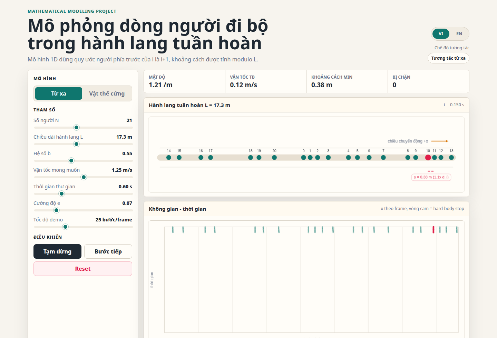

# Pedestrian Flow Model

This project implements and analyzes a microscopic model of pedestrian flow based on the principles described in the paper "Basics of modelling the pedestrian flow". The model simulates pedestrians as hard bodies with and without remote (anticipatory) action, and investigates the relationship between pedestrian density and velocity.

## Features

- **Microscopic simulation** of pedestrian movement in a 1D corridor.
- **Configurable parameters**: corridor length, relaxation time, interaction range, desired speed, etc.
- **Support for remote action**: pedestrians can anticipate and react to others ahead.
- **Data output**: simulation results are saved as CSV files.
- **Visualization utilities**: generate spatio-temporal plots and velocity-density diagrams.

## Project Structure

- `main.py` — Runs experiments, sweeps parameters, and saves results.
- `model.py` — Core simulation logic and model implementation.
- `utils.py` — Plotting and analysis utilities.
- `plot_figures.py` — Generates modern and paper-style figures from experiment CSV outputs.
- `interactive_demo.html` — Browser-based interactive demo for the 1D periodic corridor model.
- `docs/assets/` — README images and other documentation assets.
- `output/` — Directory for generated CSV and PNG files.

## Model Convention

- Pedestrians move in the increasing `x` direction on a periodic 1D corridor.
- The pedestrian in front of pedestrian `i` is `(i + 1) % N`.
- Front distance is `(x[(i + 1) % N] - x[i]) % L`.
- `simulate(..., seed=...)` can be used for deterministic runs; leaving `seed=None` keeps non-deterministic sampling.

## Getting Started

### Prerequisites

- `uv`
- Python 3.10, pinned in `.python-version`
- Dependencies are managed in `pyproject.toml` and locked in `uv.lock`.
- The locked dependencies are verified for Linux and Windows with Python 3.10.

### Install uv

Linux:
```bash
curl -LsSf https://astral.sh/uv/install.sh | sh
```

Windows PowerShell:
```powershell
powershell -ExecutionPolicy ByPass -c "irm https://astral.sh/uv/install.ps1 | iex"
```

Open a new terminal if `uv` is not found after installation.

### Installation

1. Clone the repository:
    ```bash
    git clone https://github.com/ankhanhtran02/Pedestrian-Flow.git
    cd Pedestrian-Flow
    ```

2. Install Python 3.10 and the locked dependencies:
    ```bash
    uv python install 3.10
    uv sync --locked
    ```

### Running Simulations

To run the main experiment and generate data:
```bash
uv run python main.py
```

Run a specific experiment:
```bash
uv run python main.py --experiment exp1
uv run python main.py --experiment exp2
uv run python main.py --experiment exp3
```

Run all experiments:
```bash
uv run python main.py --experiment all
```

### Generating Figures

After CSV outputs exist in `output/`, generate modern presentation figures and compact paper-style figures:
```bash
uv run python plot_figures.py
```

Generate only selected experiments or styles:
```bash
uv run python plot_figures.py --experiments exp1 exp3 --styles paper
```

### Interactive Demo



Open `interactive_demo.html` directly in a browser, or serve the repository with a local static server:

```bash
uv run python -m http.server 8765 --bind 0.0.0.0
```

Then open:

```text
http://127.0.0.1:8765/interactive_demo.html
```

In VS Code on WSL, run `Simple Browser: Show` from the command palette and paste the same URL. If port `8765` is already used, replace it with another free port such as `8766`.
Use the VI/EN toggle in the demo header to switch the interface language. The red dashed segment shows the highlighted pedestrian's front gap as an absolute distance `s` and as a ratio `s/d_i` to the required hard-body length. In Hard-body mode, orange rings in the space-time plot mark pedestrians whose step was stopped and rolled back by the hard-body constraint.

### Running Tests

```bash
uv run pytest
```
